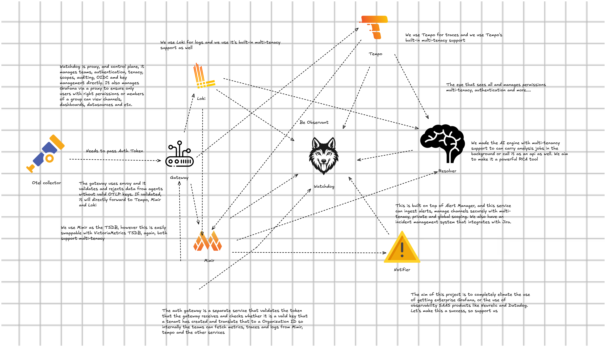

<div align="center">

# Observantio's Watchdog

  

  <p>
    <a href="https://github.com/observantio/resolver">
      
    </a>
    <a href="https://github.com/observantio/ojo">
      
    </a>
    <a href="https://github.com/observantio/notifier">
      
    </a>
    <a href="https://github.com/observantio/watchdog/tree/main/gatekeeper">
      
    </a>
  </p>
  <p>
    <a href="https://github.com/observantio/watchdog/actions/workflows/ci.yml">
      
    </a>
  </p>
  <p>
    <a href="https://github.com/observantio/watchdog/blob/main/DEPLOYMENT.md">
      
    </a>
    <a href="https://github.com/observantio/watchdog/blob/main/USER%20GUIDE.md">
      
    </a>
</p>
</div>
<div>
  <p> 
    <strong>Self-hosted observability control plane for multi-tenant teams</strong>
  </p>
  <p>
  Watchdog is built around Grafana, Loki, Tempo, Mimir, and Alertmanager, with application services that add tenancy, access control, alert workflows, and AI-assisted root cause analysis.
  </p>
</div>


If you are new to the project, the simplest way to think about it is this: the Grafana stack is the storage and query layer, and Watchdog is the application layer that makes it practical for a team and enterprise to use that stack together.

In plain terms, this workspace gives you:

- A secure entry point for telemetry ingestion.
- A web UI for logs, traces, dashboards, alert rules, incidents, and RCA.
- A control-plane API that sits in front of the Grafana stack.
- An alerting service that stores channel, rule, silence, and incident state.
- An RCA engine that correlates logs, metrics, and traces to rank possible causes.

This repository is best understood as one product made of several cooperating services.

## What The System Is Trying To Achieve

Watchdog aims to turn the raw LGTM stack into a usable multi-user application.

The base Grafana components already do storage and querying well:

- Loki stores and queries logs.
- Tempo stores and queries traces.
- Mimir stores and evaluates metrics and alert rules.
- Alertmanager handles alert routing and silences.
- Grafana renders dashboards and data sources.

Watchdog adds the pieces those components do not provide as a single opinionated product:

- Authentication and session management.
- User, group, permission, and API key management.
- Tenant-aware OTLP token validation.
- A single UI across observability, alerting, and RCA workflows.
- Shared integrations such as Jira and notification channels.
- Incident lifecycle tracking.
- AI-assisted RCA and anomaly workflows.

## What Lives In This Workspace

| Component | Role |
| --- | --- |
| `watchdog` | Main FastAPI control plane. Handles auth, users, groups, API keys, Grafana proxy bootstrap, Loki/Tempo/Mimir-facing APIs, system metrics, and secure proxying to Notifier and Resolver. |
| `gatekeeper` | OTLP token validation service for Envoy `ext_authz`. Validates `x-otlp-token`, applies allowlists and rate limits, and returns `X-Scope-OrgID` for downstream tenancy. |
| `notifier` | Alerting workflow service. Stores and serves alert rules, channels, silences, incidents, and Jira integrations. Consumes Alertmanager webhooks and protects most endpoints with an internal service token. |
| `resolver` | RCA and analysis engine. Reads logs, metrics, and traces from Loki, Mimir, and Tempo; runs anomaly detection and job-based RCA; stores RCA jobs and reports. |
| `ui` | React/Vite frontend. Exposes dashboards, logs, traces, alerts, incidents, integrations, API keys, users/groups, audit views, and RCA pages. |
| `docker-compose.yml` | Local reference deployment for the entire stack. |
| `.env.example` | Environment contract for all services. |
| `tests` | OTEL collector and sample telemetry generators used to feed demo traces and logs into the stack. |

## Repo Links

- **Watchdog (main control plane)**: https://github.com/observantio/watchdog
- **Ojo (OpenTelemetry agent)**: https://github.com/observantio/ojo
- **Notifier (alerting & incidents)**: https://github.com/observantio/notifier
- **Resolver (RCA / AIops engine)**: https://github.com/observantio/resolver

## High-Level Architecture



### Service Responsibilities

#### Watchdog | Main Proxy

This is the main application server.

From the code, it does all of the following:

- Boots the main database schema and auth service.
- Exposes login, logout, registration, OIDC exchange, MFA, user, group, audit, and API key endpoints.
- Stores and resolves the current user context, permissions, and API-key-backed scope.
- Proxies observability operations to Loki, Tempo, Grafana, Alertmanager, and Resolver.
- Exposes `/api/internal/otlp/validate` so Gatekeeper can validate OTLP tokens against Watchdog's auth model.
- Provides `/health` and `/ready` checks and a `/api/system/metrics` endpoint for internal UI metrics.
- Sets security headers, request-size limits, concurrency limits, and CORS.

#### Gateway | Secure Gate Keeper

This service is the telemetry gatekeeper.

It is designed to sit behind Envoy's external authorization hook and does the following:

- Reads `x-otlp-token` from inbound telemetry requests.
- Applies optional IP allowlists.
- Applies request rate limiting.
- Caches token validation results in memory or Redis.
- Calls the Watchdog internal validation API when a cache miss occurs.
- Returns `X-Scope-OrgID` so Loki, Tempo, and Mimir receive the correct tenant scope.

Without this service, the system would still have storage backends, but not a protected multi-tenant OTLP ingestion path.

#### Notifier | Notification and Rule Engine
 
This service owns alerting workflows beyond raw Alertmanager delivery.

From the routers and services, it is responsible for:

- CRUD for alert rules.
- Importing rules from YAML, including a dry-run preview flow.
- Syncing rule definitions to Mimir for the target organization.
- CRUD for notification channels such as email, Slack, Teams, webhook, and PagerDuty.
- CRUD for silences.
- Maintaining incidents and enforcing incident lifecycle rules.
- Recording assignment and status changes.
- Sending assignment emails when configured.
- Jira integration management and Jira ticket/comment synchronization.
- Accepting inbound Alertmanager webhooks.

#### Resolver | RCA and AIops Engine

This service is the RCA engine.

It does not replace Loki, Tempo, or Mimir. It reads from them, analyzes their data, and produces reports.

Its responsibilities include:

- Waiting for logs, metrics, and trace backends to become reachable.
- Creating RCA jobs asynchronously.
- Listing and retrieving jobs and saved reports.
- Running anomaly analysis for metrics, logs, and traces.
- Running signal correlation, topology, causal, forecast, and SLO analysis endpoints.
- Storing RCA jobs and reports in its own database.
- Enforcing internal service-to-service auth and tenant-aware permission context.

#### React UI | Interface for Users

The frontend is not a demo shell. It is the main operator experience.

The route map shows these primary pages:

- Dashboard: system summary cards and activity widgets.
- Logs: Loki query builder, raw LogQL mode, labels, quick filters, log volume, and saved state.
- Traces: Tempo query and exploration UI using Dependency maps.
- Alert Manager: active alerts, alert rules, silences, hidden items, rule import, and rule testing.
- Incidents: incident board with assignment, state changes, notes, Jira actions, and correlation labels.
- Grafana: dashboards, folders, datasources, and a controlled hand-off into Grafana through the auth proxy.
- RCA: job creation, queue view, saved report lookup, root-cause ranking, anomalies, topology, causal analysis, forecast/SLO views, and report deletion.
- Integrations: notification channels and Jira integrations with visibility and sharing controls.
- Users, Groups, API Keys, Audit/Compliance: access-management workflows.

## Docker Compose Topology

The included `docker-compose.yml` brings up the full local stack:

- `postgres` for application data.
- `redis` for rate limiting, token cache, and shared ephemeral state.
- `watchdog` as the main API.
- `notifier` for alerts, incidents, and integrations.
- `gateway-auth` for OTLP auth.
- `resolver` for RCA.
- `otlp-gateway` as Envoy on port `4320`.
- `loki`, `tempo`, `mimir`, and `alertmanager` as the storage and routing backends.
- `grafana` plus `grafana-proxy` on port `8080`.
- `ui` on port `5173`.
- `otel-agent` as a local telemetry generator harness which is under `otel` dir.

### Important Runtime Endpoints

| Endpoint | Service | Purpose |
| --- | --- | --- |
| `http://localhost:5173` | `ui` | Web UI |
| `http://localhost:4319` | `watchdog` | Main API and docs |
| `http://localhost:4320` | `otlp-gateway` | OTLP ingress through Envoy |
| `http://localhost:4323` | `notifier` | Alerting service |
| `http://localhost:8080` | `grafana-proxy` | Browser access to Grafana |

Internal-only services in the default compose layout:

- `gateway-auth` (`4321`) is reachable on the Docker network, not via host `localhost`.
- `resolver` (`4322`) is reachable on the Docker network, not via host `localhost`.

## Kubernetes Helm Charts

If you want Kubernetes deployment instead of Docker Compose, use the chart under `charts/observantio`.

- Chart path: `charts/observantio`
- Chart docs: [`charts/observantio/README.md`](charts/observantio/README.md)
- Installer script: `charts/observantio/installer.sh`

Quick start:

```bash
bash charts/observantio/installer.sh --profile production --foreground
```

Useful installer modes:

- `--profile production` for full production defaults
- `--profile compact` for smaller/constrained clusters
- `--detach` for background port-forwards
- `--no-port-forward` when you only want deployment
- `--remove` to remove the release/namespace (smoke teardown)

Customization points:

- Base values: `charts/observantio/values.yaml`
- Production defaults: `charts/observantio/values-production.yaml`
- Compact overrides: `charts/observantio/values-compact.yaml`
- Image versions: `release/versions.json` and chart values/image tags

## Environment File Overview

The root `.env.example` is the configuration contract for the whole stack.

It is large because it configures multiple services at once. Read it in these groups:

- Core runtime: host, port, log level, database URLs.
- Auth: JWT signing, bootstrap admin, OIDC, Keycloak, MFA, cookie security.
- Ingestion security: OTLP tokens, gateway allowlists, rate limits, proxy trust settings.
- Service-to-service auth: shared tokens and signing keys for Notifier and Resolver.
- Alerting: channel types, webhook tokens, SMTP settings, Jira support.
- Grafana runtime: admin password, auth proxy config, datasource provisioning.
- Resolver analysis tuning: correlation window, thresholds, timeouts, quality gating.
- Optional Vault and backup settings.

Two practical warnings for new users:

1. A few example values are placeholders, not safe defaults. Replace every `replace_with_...` value.
2. Some example lines show choices such as `AUTH_PROVIDER=local | oidc | keycloak`. You must replace those with one actual value, for example `AUTH_PROVIDER=local`.

## Quick Start

### Option A: Experimental Installer

The included installer is meant for evaluation and local testing. It is best to use the Experimental Installer if you want to develop the code, since it creates a working `.env` and starts all the required services cleanly for development.

It will:

- Check for required commands.
- Clone missing repos for `resolver` and `notifier`.
- Create or update `.env`.
- Generate secrets and a bootstrap admin account.
- Start the compose stack.

```bash
curl -fsSL https://raw.githubusercontent.com/observantio/watchdog/main/install.py -o install.py && python3 install.py
```

### Option B: Manual Setup

```bash
git clone https://github.com/observantio/watchdog Observantio
cd Observantio
cp .env.example .env
```

Before you run `docker compose up -d --build`, generate the host-aware observability config files:

```bash
bash scripts/run_optimal_config.sh
```

For local developer tooling, the workspace root and the `resolver` and `notifier` service folders now each include a `pyproject.toml` with the canonical pytest, coverage, and mypy defaults for that scope.
The root `observantio` package is a meta package for tooling and extras; install with extras (for example `pip install -e ".[dev]"` or `pip install -e ".[schemathesis]"`) rather than expecting base runtime dependencies.

Then edit `.env` and set, at minimum:

- Strong Postgres password values.
- `DEFAULT_ADMIN_USERNAME`
- `DEFAULT_ADMIN_PASSWORD`
- `DEFAULT_ADMIN_EMAIL`
- `DATA_ENCRYPTION_KEY`
- `DEFAULT_OTLP_TOKEN`
- `GATEWAY_INTERNAL_SERVICE_TOKEN`
- `NOTIFIER_SERVICE_TOKEN` and `NOTIFIER_EXPECTED_SERVICE_TOKEN`
- `RESOLVER_SERVICE_TOKEN` and `RESOLVER_EXPECTED_SERVICE_TOKEN`
- `NOTIFIER_CONTEXT_SIGNING_KEY` and `NOTIFIER_CONTEXT_VERIFY_KEY`
- `RESOLVER_CONTEXT_SIGNING_KEY` and `RESOLVER_CONTEXT_VERIFY_KEY`

Start the stack:

```bash
docker compose up -d --build
```

Check health:

```bash
docker compose ps
curl http://localhost:4319/health
curl http://localhost:4319/ready
curl http://localhost:4323/health
```

For internal services that are not published to host ports (`gateway-auth`, `resolver`), use `docker compose logs` or container-internal checks.

## Developer Quality Gates

Global quality scripts in `scripts/` support either all services or a single service argument (`resolver`, `gatekeeper`, `notifier`, `watchdog`).

Run all services:

```bash
scripts/run_global_mypy.sh
scripts/run_global_pylint.sh
scripts/run_global_pytests.sh
```

Run one service only:

```bash
scripts/run_global_mypy.sh watchdog
scripts/run_global_pylint.sh watchdog
scripts/run_global_pytests.sh watchdog
```

Use `-h` on each script for the full usage contract and environment options.


## First-Run User Journey

1. Open `http://localhost:5173`.
2. Sign in with the bootstrap admin configured in `.env`.
3. Create one or more API keys. These keys are not only UI objects; they drive tenant-scoped access and OTLP token usage.
4. Choose which API key should be the default scope in the UI. That choice affects what the frontend queries and where new rules are targeted.
5. Use the API Keys page to copy the OTLP token or generate a starter OpenTelemetry Collector YAML file.
6. Send telemetry to `http://localhost:4320` with the `x-otlp-token` header.
7. Confirm data in Logs and Traces.
8. Create or import alert rules, then connect channels and test them.
9. Review incident creation and update flows.
10. Run an RCA job after data exists.

## Known-Good Starting Point For Telemetry

The included test harness sends example traces and logs through a local OpenTelemetry Collector. If you want to connect your own collector, the important idea is:

- Logs go to `http://localhost:4320/loki`
- Traces go to `http://localhost:4320/tempo`
- Metrics go to `http://localhost:4320/mimir`
- Every request must include `x-otlp-token`

A collector pattern to start from looks like this:

```yaml
exporters:
  otlphttp/logs:
    endpoint: http://localhost:4320/loki
    headers:
      x-otlp-token: YOUR_OTLP_TOKEN

  otlphttp/traces:
    endpoint: http://localhost:4320/tempo
    headers:
      x-otlp-token: YOUR_OTLP_TOKEN

  otlphttp/metrics:
    endpoint: http://localhost:4320/mimir
    headers:
      x-otlp-token: YOUR_OTLP_TOKEN
```

## Alerting Philosophy In This Stack

The alerting flow is intentionally opinionated:

- Rules are managed as application objects, not only as raw backend config.
- Rules are synchronized to Mimir for evaluation.
- Active alerts surface in the Watchdog UI.
- Alertmanager webhook events feed Notifier.
- Incidents become first-class objects with assignees, notes, and optional Jira linkage.

If you are new to the rule editor, start from a known-good template, then tune expressions and thresholds for your environment. That approach matches how the stack is built: validate the workflow first, then narrow noise and sensitivity.


## What the UI Gives an Operator

#### Dashboard

The Dashboard provides a high-level view of platform health, including active alerts, log volume, dashboard count, silence count, datasource count, and overall service status.

If OIDC is enabled, operators are asked to set a backup local password during setup. This supports a fallback to local authentication if the business later decides to change authentication methods.

Dashboard widgets are draggable, so users can reorder components to suit their workflow. The UI also supports easy switching between dark and light themes.

#### Logs

The Logs view provides label discovery, builder-mode filtering, raw LogQL support, log volume visualisation, result browsing, and quick filters.

For most investigations, the quick filters are the fastest way to search text and review log volume over time, making it easier to identify bursts or unusual spikes in activity.

#### Traces

The Traces view provides Tempo-backed trace exploration, direct trace lookup, and a graph view for comparing traces and understanding service relationships.

Operators can filter traces, inspect trace data, and use the dependency map to identify pain points, bottlenecks, and issues in service-to-service data flow.

#### Alert Manager

Alert Manager provides:

* Active alerts
* Alert rules
* Silences
* YAML rule import with preview
* Rule testing
* Hidden and shared object handling

Alerts and silences are fully scoped by tenant and channel configuration. Integrations such as Jira are also scoped appropriately. All related configuration is stored securely and encrypted in PostgreSQL.

#### Incidents

The Incidents view provides a board-based operational workflow for managing incidents, including assignment, notes, status updates, and Jira integration.

Operators can create notes, assign incidents to users, and link incidents to Jira so that comments and lifecycle changes remain synchronised across both systems.

#### API Keys

The API Keys area provides tenant and product scoping, OTLP token management, key sharing with users and groups, token regeneration, and a downloadable starter OpenTelemetry Collector configuration.

Operators can create a new API key, download a YAML configuration for that key, or use their own collector configuration with the provided token. Once the collector runs with `otelcol-contrib --config otel.yaml`, the platform accepts metrics, logs, and traces, and maps them to the correct organisation or tenant context for retrieval through Mimir, Tempo, Loki, and Resolver.

#### Users and Groups

The Users and Groups section provides user creation, role and permission management, group-based permission inheritance, temporary password reset flows, and membership administration.

Operators can rename users, manage passwords, update permissions and roles, create groups, and assign group permissions that members inherit. A user cannot create a group with permissions higher than their own. The same restriction applies to users with `manage:tenants` capabilities — they can only grant permissions up to their own level.

Admins can update the roles of existing members. Only an admin can deactivate another admin, and admins cannot delete other admins.

#### Audit and Compliance

The Audit and Compliance section provides searchable audit history with filters, detailed inspection, and CSV export for administrative review.

Audit records are not currently designed as immutable at the database level. However, there are no routes or services that allow audit logs to be edited or deleted.

#### Grafana

The Grafana section provides controlled management of dashboards, folders, and datasources, along with secure access into the Grafana UI through the auth proxy.

All access is scoped according to the user’s permissions and visibility rights. Folder visibility acts as a container-level boundary for dashboards. If a folder is public, dashboard visibility still depends on the visibility settings of each individual dashboard.

#### RCA

The RCA section provides job creation, queue monitoring, historical report lookup, ranked root causes, anomaly detection, topology views, causal analysis, and forecast/SLO views.

This area is functionally in place, but it still requires real production data for full validation and testing.

## Important Security Model

There are three different security boundaries in this stack:

1. User-to-application auth.
   Watchdog handles login, sessions, permissions, API keys, and optional OIDC/Keycloak.

2. Telemetry-ingest auth.
   Gatekeeper validates `x-otlp-token` before Envoy forwards data to Loki, Tempo, or Mimir.

3. Service-to-service auth.
   Watchdog talks to Notifier and Resolver using dedicated service tokens and signed context JWTs.

## Limits And Expectations

- This workspace is well suited for local evaluation, demos, and homelab environments.
- The installer is explicitly experimental.
- The docs in this repository should be treated as the source of truth for this workspace, not older external deployment examples.
- Empty environments will not produce useful RCA. Resolver needs enough logs, metrics, and traces to correlate signals.

## Documentation

- Detailed walkthrough: [User Guide](USER%20GUIDE.md)
- Environment reference: [Example Environment File](.env.example)
- Release deployment and hardening: [Deployment Guide](DEPLOYMENT.md)

## License And Notices

This repository includes Apache 2.0 licensing and notice files in the root and service folders. Review them before redistribution or commercial use.
